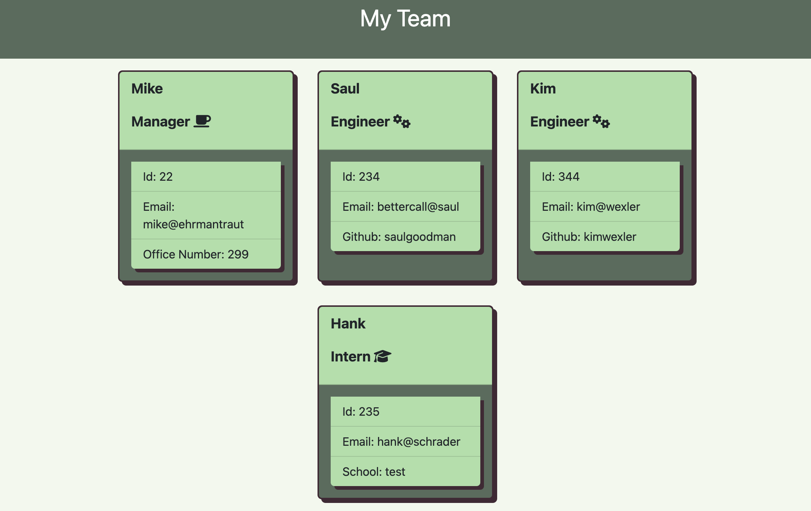

# team-profile-generator


## Description

This project uses the npm inquirer packages to create an HTML page with cards that hold information for each member of a developer team. The user will answer inquirer prompts go get the information for each team member. The information for each team member will then be displayed dynamically on a generated HTML page.

## Table of Contents

- [Installation](#installation)
- [Usage](#usage)
- [Credits](#credits)
- [License](#license)
- [Features](#features)
- [Tests](#tests)

## Installation

To install this project, you need to git clone the repository to your local machine. Then, run

```
npm install
```

to install all dependencies.

## Usage

[Link to repo](https://github.com/hope428/team-profile-generator)<br>
[Link to sample html file](https://github.com/hope428/team-profile-generator/blob/main/dist/index.html)

After installing, run

```
node index.js
```

in your terminal to start the application. You will end up with something like this when it finishes.


## Credits

[Inquirer Package](https://www.npmjs.com/package/inquirer)
[Jest](https://jestjs.io/)

## License

This project uses the MIT license

## Features

- Multiple files to create cards for each team member. They are located in the src folder.
- An interactive terminal to build your team!
- Multiple classes to implement each type of employee.
- Multiple tests developed for this project, covered more in test section.

## Tests

- Tests can be found in the _test_ folder.
- Tests were developed using the Jest testing framework
- Each class has its own testing suite. Multiple tests to validate input are implemented.
